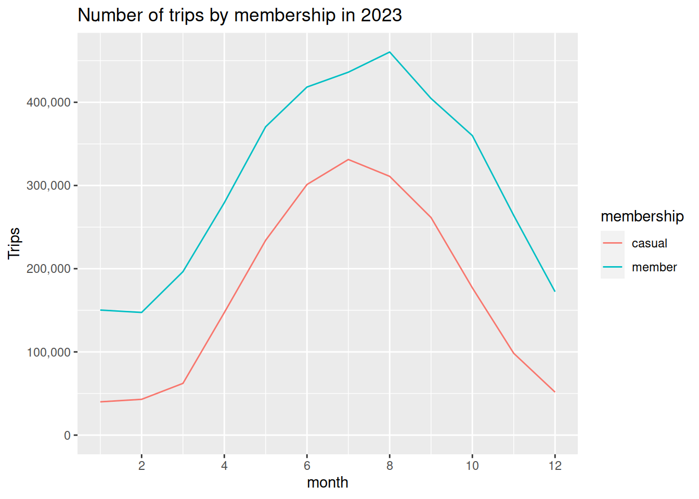
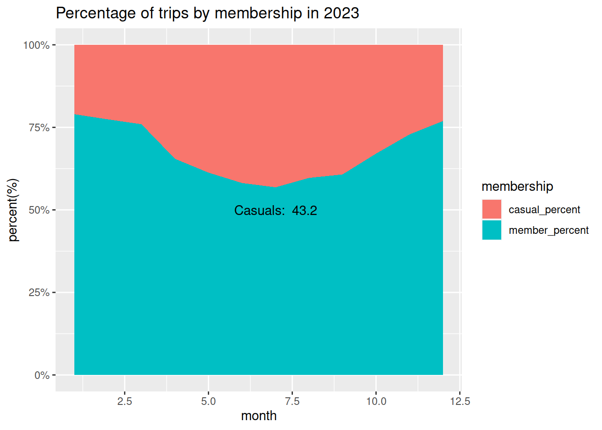
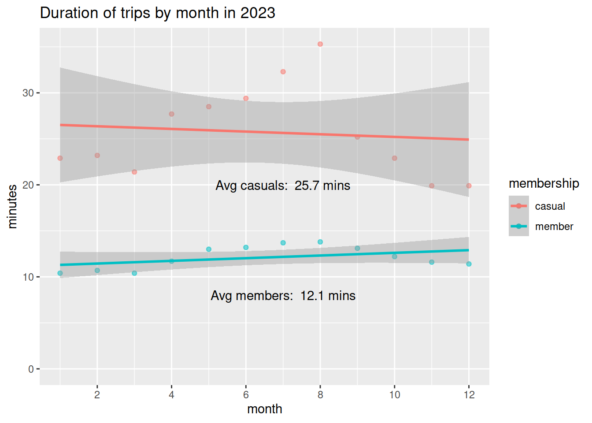
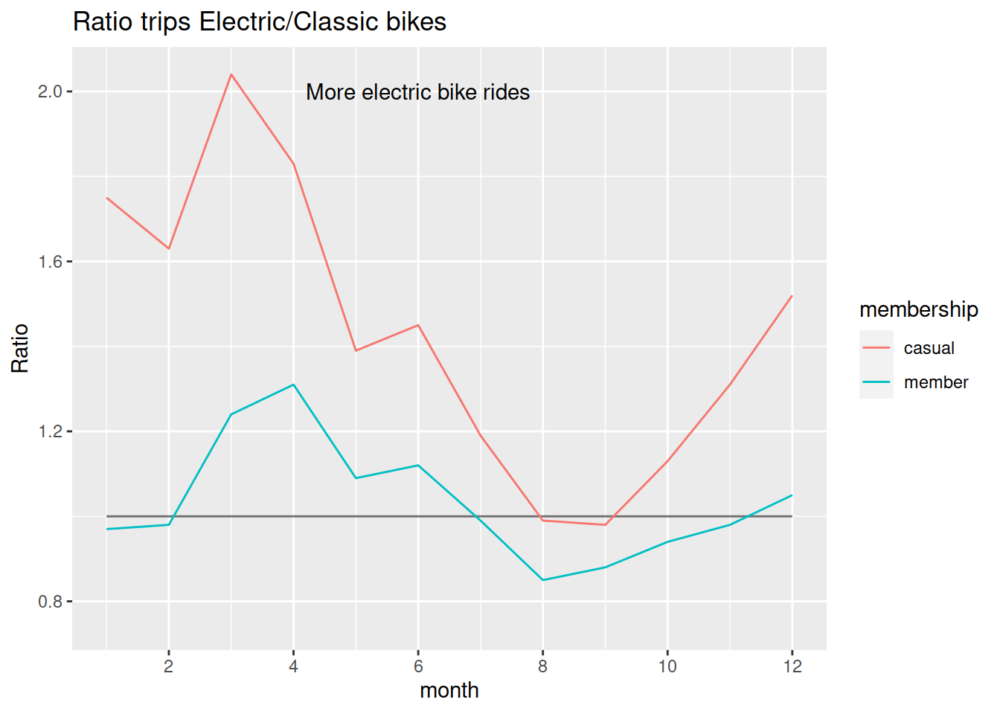
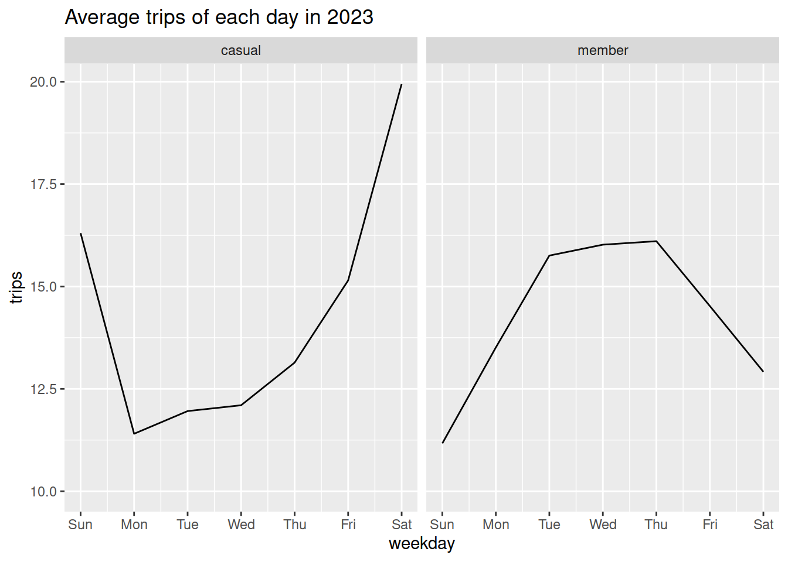
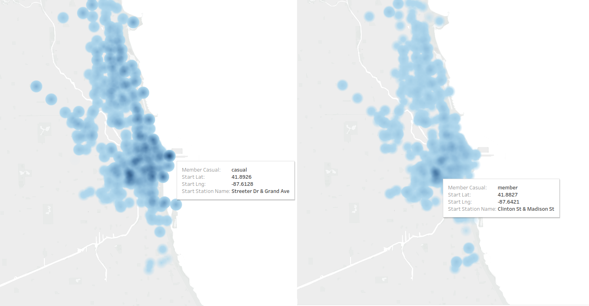

## Biketrip Analysis

A data analysis project for bike rides for the past 12 months in 2023 of 5`000.000 entries done with Python, MySQL and R with some graphics from Tableau. The business task is get the differences between casual and member customers in a bike sharing company to target casual customers to become members in a posterior marketing campaign.

The data was sourced from [here](https://divvy-tripdata.s3.amazonaws.com/index.html), The data has been made available by
Motivate International Inc. under this [license](https://www.divvybikes.com/data-license-agreement)
Data for [2023](https://www.kaggle.com/datasets/ojquirogag/bike-ridership)

## Report

[Report](./Introduction_SQLload.pdf)
### Conclusions
-   Member and casual customers use the service more in summer months, but specially casual customers that make up 43.2% of all trips in the peak month of July(7), it's better to do the capaign in these months.

-   Casual customers take much longer in their trips doubling member customers, offering incentives to become a member based in the duration of the trip could make trips even longer reducing the availability of the service with less bikes in stations.

-   Casual members use the service most often Friday, Saturday and Sunday, the campaign could be more effective these days and also offer a discount for members these days, actual members ride to a lesser degree these days.

-   Casual rides concentrate around the shoreline and specially in Streeter Dr & Grand Ave and DuSable Lake Shore Dr & Monroe St stations, the campaign has to be more prominent in these stations.

-   Casual customers ride electrical bikes more often than classical bikes, in months with high demand not so much maybe because of not enough electrical bikes at stations.

## Visualizations

[live visualization](https://public.tableau.com/app/profile/oscar.quiroga8687/viz/Densitymapridebikes/DensitymapofTOP250stations)

